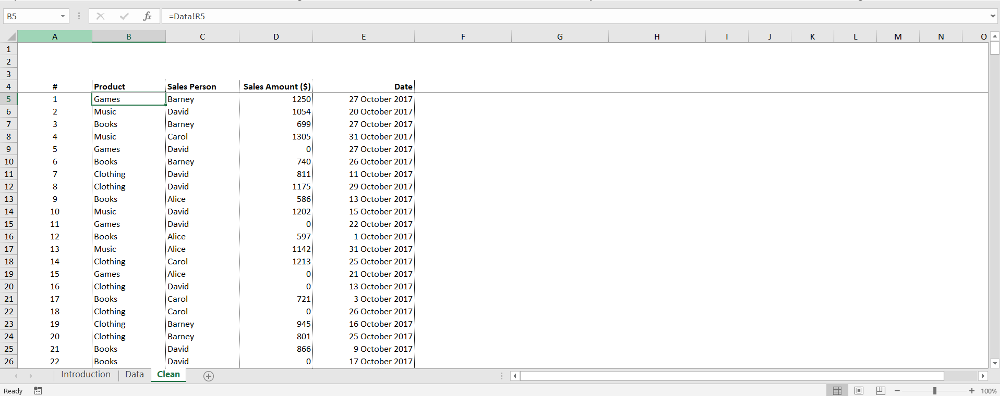

## Course Information

- Course: Excel Skills for Business: Advanced
- Platform: Coursera
- Started: 2026-08-26
- Status: In progress

## 2026-09-21  |  C4-W3-Final-AssessmentUnicode

- Completed Week 3 final assessment.

Topics practiced:
- `TRIM` – removing excess spaces from text
- `CLEAN` – removing non-printable characters
- `SUBSTITUTE` – replacing/removing specific characters
- `VALUE` – converting text values into numbers
- `LEFT`, `RIGHT`, `MID` – extracting specific parts of text
- `LEN` – measuring text length
- `CODE` and `CHAR` – converting between characters and character codes
- `FIND` – locating characters within text
- `DATE` and `TEXT` – working with dates and date formatting
- Combining multiple functions into nested formulas
- Cleaning and transforming raw data using Excel formulas
- Handling different types of spaces, including non-breaking spaces

### Screenshot:

